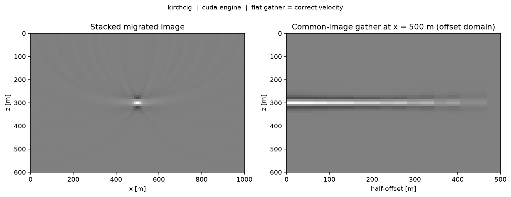
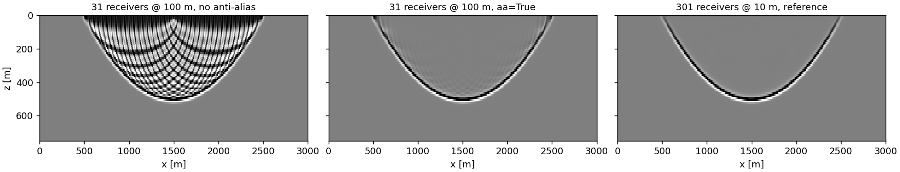
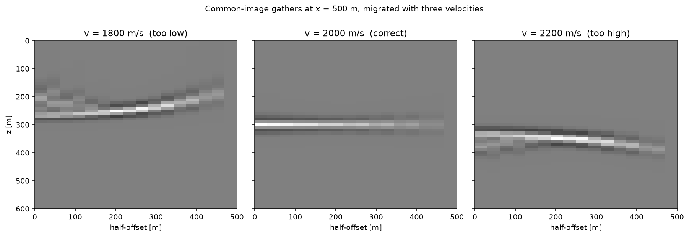

# kirchcig

**GPU 克希霍夫偏移，输出共成像点道集（CIG），并提供精确伴随算子。**

[English](README.md) | 简体中文

核函数是手写 CUDA，通过 CuPy 调 NVRTC 在运行时编译。PyTorch 只是可选的零拷贝自动微分适配层，不参与计算。



## 安装

```bash
pip install "kirchcig[cuda12]"     # GPU，CUDA 12.x
pip install "kirchcig[cuda11]"     # GPU，CUDA 11.x
pip install kirchcig               # 仅 CPU，NumPy 参考引擎
```

不需要编译器，也不需要 nvcc,核函数在运行时由 NVRTC 编译。

| 可选项 | 装什么 | 得到什么 |
|---|---|---|
| *(不加)* | `numpy` | `engine="numpy"` 参考引擎，哪里都能跑，但慢。 |
| `cuda12` / `cuda11` | `cupy-cuda12x` / `cupy-cuda11x` | `engine="cuda"` GPU 引擎，按驱动版本二选一。 |
| `eikonal` | `scikit-fmm` | 变速度模型的走时计算。 |
| `torch` | `torch` | `kirchcig.torch` 自动微分封装。 |
| `test` | `pytest`、`scipy`、`scikit-fmm` | 测试套件，以及 `op.to_scipy()`。 |

可以组合：`pip install "kirchcig[cuda12,eikonal,torch]"`。

## 快速开始

```python
import numpy as np
from kirchcig import migrate

# data  (ns, nr, nt)   叠前道集
# vel   (nx, nz)       平滑后的偏移速度 [m/s]
# srcs  (2, ns)        炮点坐标，两行分别是 (x, z) [m]
# recs  (2, nr)        检波点坐标，两行分别是 (x, z) [m]

cig = migrate(
    data, vel, srcs, recs,
    dt=0.004, dx=10.0, dz=10.0,
    nh=32, hmax=2000.0,        # 32 个半偏移距道集，最大 2000 m
)
# cig -> (32, nx, nz)

image = cig.sum(0)             # (nx, nz) 叠加剖面；nh=1 可直接得到
```

手头没数据？下面这段开箱即跑：

```python
from kirchcig import KirchhoffCIG
op = KirchhoffCIG.demo()       # 常速度模型 + 单点散射体
assert op.dot_test()
cig = op.adjoint(op.demo_data())
```

## 用法

### 算子对

做反演要用算子，而不是一次性函数：

```python
from kirchcig import KirchhoffCIG

op = KirchhoffCIG(
    nx=401, nz=201, dx=10.0, dz=10.0,
    srcs=srcs, recs=recs,
    nt=1500, dt=0.004,
    vel=vel,
    nh=32, hmax=2000.0,
    domain="offset",           # 或 "angle"
    engine="cuda",             # 或 "numpy"、"auto"
)

cig  = op.adjoint(data)        # (ns, nr, nt) -> (nh, nx, nz)   偏移
data = op.forward(cig)         # (nh, nx, nz) -> (ns, nr, nt)   反偏移
op.dot_test()                  # True
```

`forward` 与 `adjoint` 在累加精度意义下互为精确转置，可直接塞进任何最小二乘求解器：

```python
import scipy.sparse.linalg as spla
cig_lsm = spla.lsqr(op.to_scipy(), data.ravel(), iter_lim=20)[0].reshape(op.shape_model)
```

### 角度域道集

```python
op = KirchhoffCIG(..., domain="angle", nh=30, hmax=60.0)   # 30 个道集，0-60 度
```

此时 `hmax` 是最大半张角（度）。道集索引由炮点侧和检波点侧的出射角决定，出射角从走时梯度算出。

### 抗假频滤波

```python
op = KirchhoffCIG(..., aa=True)                 # 默认 aa_factor=1.0, aa_max=32
```

克希霍夫求和在算子相邻两道之间的时差超过最高频率半个周期的地方就会假频，表现为大偏移距、浅层处陡倾、交叉的弧形伪影；道距粗时它们会淹没整个剖面。`aa=True` 让每一项贡献都经过一个半宽随当地算子倾角变化的三角滤波器再进入求和，这是 Lumley、Claerbout 与 Bevc（1994）的标准做法，Claerbout 的 `trimo` 和 Madagascar 的 `sfmig2` 用的都是它。



<sub>一炮，每道一个带限脉冲。左：31 道 @ 100 m，直接求和。中：同一份数据，`aa=True`。右：301 道 @ 10 m，不滤波。`python examples/antialias.py`。</sub>

- `aa_factor` 缩放滤波宽度，等价于 `trimo` 和 `sfmig2` 的 `antialias=` 参数（三者默认都是 1.0）。取 2.0 时三角谱的第一个零点正好落在假频频率上，代价是陡倾角处的分辨率。
- `aa_max` 限制半宽的样点数上限（默认 32）。
- 算子倾角由走时表沿道轴差分得到，因此 eikonal 走时和自带走时表都能用。炮点、检波点轴必须沿测线排序，否则构造时会给出警告。
- 算子对仍然是精确转置，开着滤波 `dot_test()` 照样通过。
- 代价：滤波通过道的双重累加上的一个三抽头恒等式施加，所以开销与滤波宽度无关。但需要一份 float64 的数据副本，`ns * nr * (nt + 2*aa_max + 1) * 8` 字节，且伴随每项贡献读 3 个 float64 抽头而不是 1 个 float32 样点。V100 上伴随 1.9 倍、正演 2.6 倍（见「性能」一节）；`python benchmarks/bench.py --aa` 可在你的卡上实测。

### 偏移孔径

```python
op = KirchhoffCIG(..., aperture=60.0)           # 与垂直方向的锥角半角 [度]
op = KirchhoffCIG(..., apt=3000.0)              # 或横向距离 [m]；两者可以同时给
```

一条道只对同时落在其炮点**和**检波点孔径内的成像点有贡献：在它们正下方 `aperture` 度的锥内（`sfkirmig` 的 `aperture=`），或横向距离不超过 `apt` 米（`sfmig2` 的 `apt=`，这里单位是米）。这既压远端摆动噪声，又跳过被丢弃贡献的计算。README 那个几何下 60° 锥保留 47% 的道–成像点对（45°：23%）；V100 上正演从 25.5 ms 降到 17.2 ms，伴随则维持在 55 ms 左右——它的 block 是一段深度列，横跨锥面边缘，被掩掉的线程只能等同一 warp 里其他线程做完 gather，而且每个 pair 的合并表读取照样要做。所以把孔径当作一个附带正演加速的成像控制项来用。和 Madagascar 一样是硬截断；`op.aperture_masks()` 返回两个布尔掩码，`python benchmarks/bench.py --aperture 60` 会打印保留比例和计时。

孔径在主机端施加：把被掩掉的走时表项推到道的末端之外，内核本来就会跳过那里。不改内核，两个引擎丢掉的贡献完全相同，算子对仍是精确转置。

### 半阶导数（rho）滤波

```python
op = KirchhoffCIG(..., halfderiv=True)
```

2D 克希霍夫反偏移需要一个时间上的半阶导数。把每个成像点沿走时曲线铺开、再对整条反射层求和，横向那一维积分的驻相因子会留下来：45° 相位旋转和 `|ω|^-1/2` 的谱倾斜。于是反偏移出来的水平反射层还不回构造它时用的子波，偏移出来的反射层则反方向旋转。`halfderiv=True` 在 `forward` 输出的每条道上施加 `H(ω) = sqrt(1 − ρe^{−iω})`（后向差分的平方根），在 `adjoint` 读入数据时施加它的精确转置。这正是 Madagascar `sf_halfint` 实现、`sfmig2`/`sfkirchnew`/`sfkirmod` 使用的滤波器，泄漏系数默认同样是 `ρ = 1 − 1/nt`；`halfderiv_rho` 可改。

代价是每道一次 float64 FFT，在引擎所在设备上运行，与内核无关。开着它 `dot_test()` 照样通过。两点要知道：离散滤波器带四分之一个样点的延迟（相位是 `π/4 − ω/4`），所以偏移出来的反射层在双程时间上浅 `dt/4`，往返一次则没有位移；深度网格要能分辨时间采样（`2·dz/v ≤ dt`），否则反偏移的道是一排插值脉冲，开不开滤波都一样。

### PyTorch

```python
from kirchcig.torch import TorchKirchhoffCIG

top = TorchKirchhoffCIG(op)
cig = top.adjoint(data)        # 对 data 可微
res = top.forward(cig) - data
res.pow(2).sum().backward()
```

张量全程留在 GPU 上。由于算子是线性的，`forward` 的反向就是 `adjoint`，反之亦然；反向过程本身也被记录进计算图，所以二阶导数能正常工作。

### 自定义走时表

```python
op = KirchhoffCIG(..., trav=(trav_srcs, trav_recs))
# trav_srcs (ns, nx, nz)   炮点到成像点的走时 [s]
# trav_recs (nr, nx, nz)   成像点到检波点的走时 [s]
```

不传的话，走时来自程函方程求解（`scikit-fmm`），常速度时用解析式。注意维度顺序：炮/检波点轴在最前面，与某些其他库是转置关系,这样才能保证伴随核函数的读取是合并访问的。

### 数组形状

| | 形状 | 说明 |
|---|---|---|
| 数据 | `(ns, nr, nt)` | float32 |
| 模型（CIG） | `(nh, nx, nz)` | 道集轴在最外层 |
| `srcs`、`recs` | `(2, ns)`、`(2, nr)` | 两行是 `(x, z)`，单位米 |
| 速度 | `(nx, nz)` 或标量 | m/s |

## 示例

```bash
python examples/plot_cig.py          # 封面那张图
python examples/vel_analysis.py      # 下面那张图
python examples/antialias.py         # 上面的抗假频图
python examples/lsqr_migration.py    # 用 SciPy LSQR 做最小二乘偏移
python examples/torch_deep_prior.py  # 深度先验 LSM
python benchmarks/bench.py           # 性能测试
```



<sub>同一份数据用三种速度偏移。同相轴拉平即速度正确；沿偏移距轴的剩余曲率正是偏移速度分析所测量的量，而叠加会把它抹掉。</sub>

## 性能

单张 **Tesla V100-PCIE-32GB**（驱动 580.178.04），`nx=401, nz=201, ns=100, nr=200, nt=1500, nh=32`，偏移距域。每次算子作用需要计算 1.6e9 个「道 × 成像点」配对。

| 累加器 | adjoint（偏移） | forward（反偏移） | 点积测试相对误差 |
|---|---|---|---|
| `float64`（默认） | 52.9 ms — 30.5 G 配对/秒 | 25.5 ms — 63.2 G 配对/秒 | 9.5e-08 |
| `float32` | 33.5 ms — 48.2 G 配对/秒 | 18.8 ms — 85.8 G 配对/秒 | 1.1e-07 |
| `float64`，`aa=True` | 98.5 ms — 16.4 G 配对/秒 | 67.4 ms — 23.9 G 配对/秒 | 2.0e-08 |

算子构建（含走时表与一次性 NVRTC 编译）约 1.4 s（`aa=True` 时 2.0 s，多出的是对走时表差分算算子倾角）。抗假频在伴随上是 1.9 倍开销（每项贡献读 3 个 float64 抽头而不是 1 个 float32 样点），正演 2.6 倍（6 次共享内存原子加代替 2 次，加上 float64 输出及其反向积分）。`forward` 比 `adjoint` 快近一倍：它每个 block 处理一个道，在共享内存里累加完一次写出；而 `adjoint` 要沿走时曲线做不规则的散射读取。

float64 累加在 Volta 及其他数据中心卡上几乎不增加开销（FP64:FP32 为 1:2），换来的是与 NumPy 参考引擎逐位一致的结果。消费级 GeForce 卡上这个比例约为 1:64，在那类卡上应默认使用 `acc="float32"`,代价约为 1e-7 的相对精度。

复现：`python benchmarks/bench.py`，可接受 `--acc float32`、`--nh`、`--domain`、`--aa`、`--aperture`、`--halfderiv`、`--engine numpy` 等参数。前两行是不开抗假频的结果。算子在单张卡上运行，可通过 `cupy.cuda.Device` 指定设备；使用 PyTorch 封装时则由张量所在设备决定。

## 实现

核函数以 CUDA C++ 字符串的形式存放在 `kirchcig/_kernels.py`，首次使用时由 `cupy.RawKernel(..., backend="nvrtc")` 编译，之后由 CuPy 缓存。CuPy 只负责分配显存、编译和启动，所有算术都在核函数里。

- **为什么手写核函数。** 克希霍夫偏移的本质是沿走时曲线的不规则 gather，既不是矩阵乘也不是卷积,没有哪个张量算子能在不爆掉访存的前提下表达它。直接写核函数也是下面这几条优化得以成立的前提。
- **伴随算子完全不用原子操作。** 一个线程负责一个成像点并独占整条道集轴，所有写入互不冲突。累加器放在共享内存中，布局为 `[nh][block]`，对任意的每线程道集索引都无 bank 冲突。block 大小自动从 {256,128,64,32} 中选取，以累加器不超过 32 KB 为准；`nh` 很大时退到 32 线程并 opt-in 到设备共享内存上限。
- **正演每个道一个 block**，用廉价的共享内存原子操作累加完整条道后一次性写出。
- **伴随关系由构造保证。** 两个核函数用**完全相同的 float32 表达式**计算样点索引和插值权重，因此这一对算子就是同一个稀疏矩阵的转置，差别只来自求和顺序。
- **累加器默认 float64。** 一个偏移样点要累加 10^4 到 10^5 项。用 float64 累加时，CUDA 引擎与 NumPy 参考引擎逐位一致；改用 float32 约引入 1e-7 相对误差，换来约 1.5 倍加速。
- **模型布局 `(nh, nx, nz)`** 同时保证伴随的回写和正演的模型读取都是合并访问。
- **编译期特化。** `nh`、block 大小、累加器类型、偏移距/角度域开关都通过 `-D` 注入，因此 `nh` 是真正的编译期常量。改动它会触发一次约一秒的 NVRTC 重编译。
- **抗假频只花三个抽头，不循环。** 半宽 `n` 的三角滤波作用在道 `d` 上等于 `(D[i+n-1] - 2 D[i-1] + D[i-n-1]) / n^2`，`D` 是 `d` 的双重累加，所以任何宽度的滤波贡献都只是三次插值读取。伴随核函数读的是 CuPy 用两次 cumsum 准备好的 float64 `D`；正演核函数散射转置后的六个抽头，再由 CuPy 反向双重累加。`D` 按 `nt^2` 增长而二阶差分几乎全部抵消，所以它必须是 float64，正演的道累加器在 `aa=True` 下也不论 `acc` 一律 float64。算子倾角打包在走时表元素里紧挨走时，多出来的输入只是一次更宽的合并读取，而不是再读一张表。
- **PyTorch 不做任何数值计算。** `kirchcig.torch` 只通过 DLPack 与 CuPy 交换显存（数据不离开 GPU，非默认 stream 也会被正确处理），并把这一对算子注册为 `autograd.Function`。卸掉 torch，CUDA 引擎不受任何影响。

大规模问题通过时间轴分块和炮点轴分片处理，两者都是精确的,测试套件会验证分片结果与不分片完全一致。

## 已知限制

- **尚无幅度权。** 算子是单位权求和（倾斜因子与几何扩散在 `IMPLEMENTATION_NOTES.md` 的路线图里）。
- **正演不对深度→时间的拉伸做抗假频。** `2·dz/v > dt` 时反偏移的道是一排插值脉冲；请取 `dz ≤ v·dt/2`（Madagascar 的 `sfkirmod` 用 `aastretch` 处理这个问题，计划中）。
- **仅支持 2D。** 瓶颈在走时表，不在核函数。
- **偏移距分道集用的是半偏移距绝对值**，因此不区分正负偏移距。

## 相关项目

SEG-Y 读写：[segyio](https://github.com/equinor/segyio)。算子代数与求解器：[PyLops](https://github.com/PyLops/pylops)，kirchcig 通过 `to_scipy()` 接入。波动方程正演与 RTM：[Deepwave](https://github.com/ar4/deepwave)。

## 依赖

Python >= 3.10 和 `numpy`。可选：与 CUDA 版本匹配的 `cupy`（GPU 引擎）、`scikit-fmm`（程函走时）、`scipy`（`to_scipy()`）、`torch`（仅用于自动微分封装，不参与计算）。

欢迎贡献。`pytest -q` 会在两个引擎下运行点积测试；没有可见 GPU 时 CUDA 测试自动跳过。

## 引用

<TODO: Zenodo DOI>

## 许可证

MIT

---

<sub>关键词：克希霍夫偏移, 叠前深度偏移, 共成像点道集, CIG, 角道集, 偏移距道集, GPU 地震成像, CUDA, CuPy, 最小二乘偏移, LSM, 精确伴随, 反偏移, 偏移速度分析, AVO, AVA, PyTorch, 地震反演。</sub>